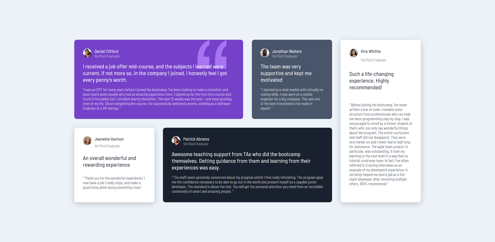

# Frontend Mentor - Testimonials grid section solution

This is a solution to the [Testimonials grid section challenge on Frontend Mentor](https://www.frontendmentor.io/challenges/testimonials-grid-section-Nnw6J7Un7). Frontend Mentor challenges help you improve your coding skills by building realistic projects. 

## Table of contents

- [Overview](#overview)
  - [The challenge](#the-challenge)
  - [Screenshot](#screenshot)
  - [Links](#links)
- [My process](#my-process)
  - [Built with](#built-with)
  - [What I learned](#what-i-learned)
  - [Continued development](#continued-development)
- [Author](#author)
- [Acknowledgments](#acknowledgments)


## Overview

### The challenge

Users should be able to:

- View the optimal layout for the site depending on their device's screen size

### Screenshot




### Links

- Solution URL: [Add solution URL here](https://your-solution-url.com)
- Live Site URL: [Add live site URL here](https://your-live-site-url.com)

## My process

### Built with

- Semantic HTML5 markup
- BEM notation
- SASS preprocessor
- Responsive units
- CSS Grid
- Mobile-first workflow


### What I learned

I learned how to use grids to built a responsive layout easily. And on the overall page layout but on a small components too. Like a user block:

```css
&__user {
    display: grid;
    grid-template-columns: min-content max-content;
    grid-column-gap: 1rem;
}
```
Also I learned the mobile-first workflow and discovered for myself that it's more convinient and efficient way to write code, because this way I have way less lines of code in my scss files


### Continued development

I'm planning to build more complex and smart layouts using grid and all the advanced that I'm going to learn soon :)


## Author

- Frontend Mentor - [@tr43om](https://www.frontendmentor.io/profile/tr43om)


## Acknowledgments

While doing this challenge, I realised the importance to keep practicing and implementing new skills and knowledge that I learned. Because If you just reading/watching and not doing you won't be able to build sites for yourself. It's like you watched a whole bunch of videous of how to ride a bycicle and then try to actually ride but you won's because you haven't practiced  
